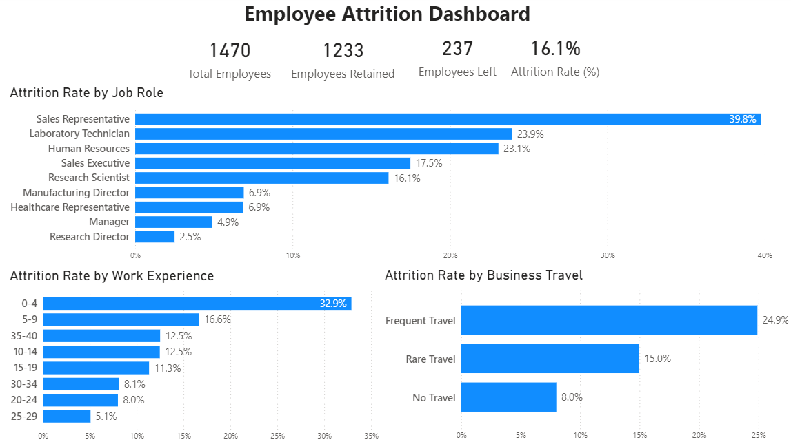

# Employee Attrition Analysis Dashboard

An interactive HR analytics dashboard built using **Excel** and **Power BI** to analyze employee attrition and identify actionable hiring and retention insights.

---

## Project Overview

Employee attrition is one of the biggest challenges faced by Human Resources teams. High employee turnover increases recruitment costs, disrupts productivity, and impacts organizational performance.

The objective of this project was to analyze historical employee data and identify the key factors associated with employee attrition. This project focuses on answering a few high-impact business questions that HR managers can use to support hiring and retention decisions.

---

## Business Objective

Help HR teams improve hiring and retention decisions by identifying:

- Which job roles require the highest hiring focus.
- Whether prior work experience influences employee attrition.
- Whether business travel requirements are associated with employee attrition.

---

## Business Questions

### 1. Which job roles should HR prioritize for hiring?

Identify job roles with the highest employee attrition rates to determine where recruitment efforts should be focused.

### 2. Does prior work experience influence employee attrition?

Analyze whether employees with different levels of work experience exhibit different attrition rates.

### 3. Does business travel affect employee attrition?

Determine whether travel requirements are associated with increased employee turnover.

---

## Tools Used

- Microsoft Excel
  - Exploratory Data Analysis (EDA)
  - Pivot Tables
  - Business Analysis

- Power BI
  - Interactive Dashboard
  - DAX Measures
  - Data Visualization

---

## Project Workflow

```
Raw Dataset
        │
        ▼
Exploratory Analysis (Excel)
        │
        ▼
Business Insights
        │
        ▼
Interactive Power BI Dashboard
```

---

## Dashboard Preview



---

## Key Insights

### High Attrition Job Roles

- Sales Representatives have the highest attrition rate (39.8%).
- Laboratory Technicians and Human Resources roles also experience relatively high employee turnover.

### Work Experience

- Employees with 0–4 years of work experience show the highest attrition rate (32.9%).
- Attrition generally decreases as prior work experience increases.

### Business Travel

- Employees who travel frequently have the highest attrition rate (24.9%).
- Employees with no business travel requirements have the lowest attrition rate (8.0%).

---

## Business Recommendations

Based on the analysis, the following actions are recommended:

- **Prioritize recruitment for high-attrition job roles**, particularly **Sales Representatives**, **Laboratory Technicians**, and **Human Resources**, to proactively address workforce shortages and maintain business continuity.

- **Strengthen retention strategies for early-career employees** by investing in structured onboarding, mentorship programs, clear career progression, and targeted retention incentives where appropriate. Employees with **0–4 years of work experience** exhibit the highest attrition rate, making this group the highest priority for retention efforts.

- **Align hiring with business travel expectations** by clearly communicating travel requirements during recruitment and assessing candidates' willingness to travel before hiring. Employees in roles requiring **frequent business travel** experience significantly higher attrition, making expectation alignment essential for improving long-term retention.

---

## Project Structure

```
employee-attrition-analysis/
│
├── data/
│   ├── employee_attrition_raw.csv
│   └── employee_attrition_analysis.xlsx
│
├── images/
│   └── employee_attrition_dashboard.png
│
├── powerbi/
│   └── employee_attrition_dashboard.pbix
│
└── README.md
```

---

## Dataset

IBM HR Analytics Employee Attrition & Performance Dataset

The dataset contains employee demographic, job-related, and organizational information, including:

- Job Role
- Department
- Business Travel
- Work Experience
- Education
- Attrition
- Monthly Income
- Job Satisfaction
- Work-Life Balance
- Performance Rating
- and other employee attributes.

---

## Conclusion

This project demonstrates how exploratory business analysis and interactive dashboards can be used to transform employee data into actionable HR insights. Rather than presenting descriptive statistics alone, the dashboard focuses on answering practical business questions that support recruitment planning and employee retention strategies.